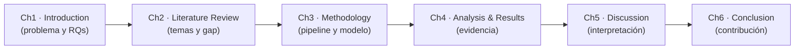
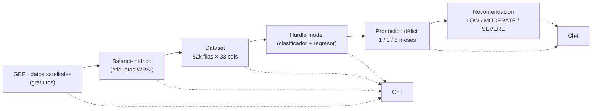

# ALSRS — Mapa metodológico de tesis

Plan de trabajo para estructurar la tesis de maestría a partir del proyecto
ALSRS ya construido. Cada capítulo mapea los artefactos existentes (código,
notebooks, documentación, bibliografía) hacia la redacción académica.

---

## 1. Mapa conceptual (progresión de la tesis)

## 2. Mapa del pipeline ALSRS → capítulos

## 3. Mapeo capítulo × lo que ya tienes × lo que falta

| Capítulo | Contenido | Ya tienes | Falta escribir |
|---|---|---|---|
| **1. Intro** | contexto, problema, RQs, aporte | motivación + pipeline + contexto agrícola | RQs/objetivos formales + redacción |
| **2. Lit Review** | 7 temas + gap | `BIBLIOGRAPHY.md` (organizada por tema) | síntesis crítica + gap argumentado |
| **3. Metodología** | pipeline, datos, modelo, evaluación | `ml/ML_MODEL.md` + `ml/DATASET_DICTIONARY.md` + `ml/collect_training.py` | redacción formal (casi listo) |
| **4. Resultados** | cero-inflated, baseline, hurdle, gate, clases, CV | `ml/01` / `ml/02` / `ml/04` notebooks | presentación objetiva (tablas/figuras) |
| **5. Discusión** | interpretar hallazgos | conversaciones (phantom deficit, flexibilidad, complementariedad) | redacción crítica |
| **6. Conclusión** | resumen, contribución, futuro | híbrido, `predict_point`, otros cultivos | redacción breve |
| **7. Referencias** | — | `BIBLIOGRAPHY.md` ✅ | formatear al estilo de la universidad |

**Tres puntos de trabajo intelectual real (no mecánico):**
1. Articular el **research gap** (Ch1.2 + Ch2.3).
2. Formalizar las **research questions y objectives** (Ch1.3).
3. La **discusión** (Ch5).

---

## 4. Research gap (recomendación)

**Lo que ya existe (y sus límites):**
- El ML agrícola se enfoca en **predicción de rendimiento** o **clasificación de
  sequía**, no en la **decisión de riego** (el déficit) como target explícito.
- Muchos usan datos **de pago/cerrados**, o ignoran que el déficit es
  **zero-inflated**, lo que un regresor único maneja mal.
- El **two-part/hurdle model** (Cragg 1971; Mullahy 1986; Lambert 1992) es
  clásico en econometría, pero **rara vez se aplica al pronóstico de déficit
  hídrico agrícola con features satelitales**.

**El gap que atacas:**
> Combinar **etiquetas débilmente supervisadas con base física (balance
> hídrico/WRSI)** + un **modelo hurdle (clasificador + regresor)** para
> pronosticar necesidad de riego, usando **datos satelitales gratuitos**, en un
> marco **transferible entre cultivos**.

**El aporte (3 patas):**
1. **Metodológico** — aplicar el hurdle a un contexto nuevo y demostrar *por qué*
   funciona (elimina el "déficit fantasma" → MAE −31% a −63% en el test).
2. **Empírico** — evidencia real en cacao colombiano (239 fincas, 52k registros)
   y caña de azúcar (340 fincas, 75k registros), en Colombia y Australia.
3. **Práctico** — sistema transferible (crop es un parámetro) con clasificación
   ajustable al negocio sin re-entrenar.

---

## 5. Research questions y objectives

**RQ principal:**
> ¿Cómo pueden datos satelitales y climáticos **gratuitos**, combinados con
> **etiquetas de base física** (balance hídrico), usarse para **pronosticar la
> necesidad de riego** (déficit hídrico) mediante machine learning?

**Sub-preguntas:**
- **RQ1 (etiquetado):** ¿Puede un balance hídrico quincenal (WRSI) generar
  etiquetas de déficit con base física a partir de datos GEE gratuitos?
- **RQ2 (modelado):** ¿Mejora un modelo hurdle (clasificador + regresor) el
  pronóstico de déficit frente a un regresor único, dado el carácter
  zero-inflated del target?
- **RQ3 (decisión/transferencia):** ¿Cómo afecta el esquema de clases (4/3/2) al
  recall de la decisión, y es el enfoque transferible entre cultivos?

**Objetivos (mapeados a las RQ):**
- **O1** → construir el pipeline ALSRS (GEE + balance hídrico + AHP). *(soporta RQ1)*
- **O2** → construir y evaluar el modelo hurdle vs baseline. *(soporta RQ2)*
- **O3** → evaluar la clasificación flexible y la transferibilidad. *(soporta RQ3)*

---

## 6. ✅ Transferibilidad: resuelta (RQ3)

Se tomó la opción **(A)** y se demostró. Se corrió `sugarcane` (340 fincas,
Colombia + Australia) con el mismo pipeline y hurdle, cambiando solo el umbral
del gate (0.5 → 0.75). Resultado: el modelo transfiere entre perennes, con
reducción de MAE en test de 63.9% / 39.2% / 15.5% (1/3/6 meses) y recall SEVERE
de 0.92 (vs 0.65 de cacao).

El hallazgo clave es el **gradiente de zero-inflación**: cacao 72.8% → caña 35.0%
→ trigo 10.1% (a 1 mes), y la reducción del hurdle cae con ella (63.1% → 15.5% a
6 meses). Esto confirma el mecanismo: el hurdle ayuda proporcionalmente a cuánto
"déficit fantasma" hay que eliminar.

**Trigo (anual):** no transfirió (casi sin ceros, clase LOW vacía). Quedó
documentado como **limitación** (Cap. 5), no como resultado.

---

## 7. Orden de trabajo

1. Fijar RQs + objetivos + gap (Ch1.3 y Ch2.3) — el ancla de todo.
2. Decidir el punto 6 (¿demostrar transferibilidad con caña o acotarla?).
3. Escribir Ch2 (Literature Review) con `BIBLIOGRAPHY.md` ya organizada.
4. Escribir Ch3 (Metodología) — casi transcribir `ML_MODEL.md` + `DATASET_DICTIONARY.md`.
5. Ch4 (Resultados) — exportar tablas/figuras de los notebooks `01`/`02`/`04`.
6. Ch5 (Discusión) — convertir los hallazgos en argumento.
7. Ch1 (Intro) al final + Ch6.

---

## 8. Apéndices (orden lógico, no por aparición)

Los apéndices siguen el orden del pipeline (datos → modelo → análisis → código →
configuración), para que el lector los recorra de forma natural.

| Apéndice | Contenido | Archivos |
|---|---|---|
| **A — Diccionario de datos** | features (17), targets (3), WRSI, estacionalidad, split | `ml/DATASET_DICTIONARY.md` |
| **B — Documentación del modelo** | hurdle (2 etapas), gate, 3 clases, weighting, evaluación | `ml/ML_MODEL.md` |
| **C — Notebooks de análisis y experimentos** | zero-inflated + correlación ONI, hurdle/gate/sweep, clases, modelo final 70/10/20 | `test/MDS650_260903_dataset.ipynb`, `ml/01`–`ml/05`, `test/ml/evaluate_model.py` |
| **D — Código fuente del pipeline** | balance hídrico, viabilidad, AHP, colección de datos | `analysis/*.py`, `extraction/*.py`, `ml/collect_training.py` |
| **E — Datos de configuración** | parámetros de cultivo, pesos AHP, puntos | `databases/crop_parameters_260822.csv`, `databases/ahp_weights.csv`, `ml/points/{cacao,sugarcane,wheat}_points.csv` |

### Mapa de respaldo (qué sección de la tesis referencia qué apéndice)

| Sección | Afirmación / decisión | Apéndice |
|---|---|---|
| Ch3 §3.4 | Ventana WRSI de 1 mes (12 meses aplana a ~9%) | A |
| Ch3 §3.6 | 17 features / 3 targets | A |
| Ch3 §3.7 | Hurdle + gate + 3 clases | B (+ C) |
| Ch3 §3.2 / §3.5 | 7 cultivos + screening AHP | E (+ D) |
| Ch3 §3.3 | Fuentes de datos GEE (CHIRPS, ERA5, MODIS, SoilGrids…) | D |
| Ch4 §4.2 | Zero-inflation 72.8/56.4/39.2% | C |
| Ch4 §4.3 | Baseline + phantom deficit ~11.8 | C |
| Ch4 §4.4 | Test MAE 4.37/5.15/7.29 (−63.1/−54.7/−31.3%) | C |
| Ch4 §4.5 | Gate sweep (validation) | C |
| Ch4 §4.6 | Accuracy 0.688→0.784→0.855 + confusión + directo | C |
| Ch4 §4.7 | Persistence baseline | C |
| Ch4 §4.8 | Learning curve | C |
| Ch4 §4.8 | Correlación ONI 0.15/0.19/0.21 | C |
