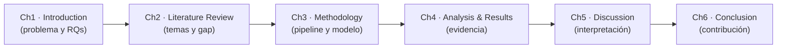

# Chapter 1 — Introduction

**Agricultural Land Suitability Recommendation System Based on Open Geospatial Data and Remote Sensing: A Case Study in Colombia and Australia**

## 1.1 Background and Research Context

Water is the main limit on agricultural production. Whether a crop is rain-fed or irrigated, yield and profit depend on the timing and severity of water deficit, meaning the difference between the water a crop needs and the water available to it \[1\], \[2\]. Climate variability adds to the uncertainty. El Niño–Southern Oscillation (ENSO) events, for instance, move rainfall from one season to another \[3\].

Land suitability assessment has always been about the *where* question. It checks soil, climate and terrain against what a specific crop requires \[4\], and multi-criteria methods like the Analytic Hierarchy Process (AHP) turn those checks into a single suitability score \[5\]. But suitability answers a static question: is this land good enough? It does not answer the question that comes after, which is temporal and operational: given a suitable location, will this crop need irrigation in the coming weeks or months?

Two changes make a predictive answer possible. The first is data. Freely available satellite and reanalysis products now offer continuous, global coverage over several decades. This includes precipitation (CHIRPS \[6\]), temperature (ERA5-Land \[7\]), evapotranspiration (MODIS \[8\]) and soil properties (SoilGrids \[9\]), all reachable through the Google Earth Engine (GEE) cloud platform. The second change is methods. Machine learning, and Random Forests \[10\] in particular, can learn non-linear relationships from these large, multi-source datasets.

This thesis builds the Agricultural Land Suitability Recommendation System (ALSRS). The idea is to join suitability assessment with operational water management. ALSRS works in two parts. First, a physically based water balance, the Water Requirement Satisfaction Index (WRSI), turns free satellite data into irrigation-need labels. Second, a two-stage (hurdle) machine learning model forecasts the water deficit 1, 3 and 6 months ahead. The output is a biweekly recommendation of irrigation severity. By default this is LOW, MODERATE or SEVERE, but the system can also use four or two classes (see RQ3).

The system is parameterised for seven crops through a crop-parameter table that describes soil, climate and water-requirement characteristics: sugarcane, cacao CCN-51, arabica coffee, plantain, wheat, sorghum and canola. For the empirical validation in this thesis, three crops were chosen to cover both case-study countries. Cacao CCN-51 is a high-yielding tropical perennial plant in Colombia. Wheat is an annual plant of temperate climate grown commercially in Australia. Sugarcane is a perennial plant of significant economic importance that is cultivated in both countries. The choice is deliberate: it includes a tropical and a temperate climate, a perennial and an annual crop, and one crop shared by both countries, so a good result on all three is evidence of transferability across climates and crop types.

## 1.2 Research Problem and Motivation

The core problem is that irrigation need has to be predicted. Water deficit is zero-inflated: in most biweekly periods there is no deficit at all, but when a deficit appears it can be severe. This is most visible for cacao, where 73%, 56% and 39% of the records have zero deficit at the 1, 3 and 6 month horizons. Sugarcane follows the same pattern, though less sharply, at 35%, 17% and 7%. A single regression model has to learn two things at once: whether a deficit will happen, and how big it will be. One model does both badly. A single Random Forest regressor, for example, predicts a "phantom deficit" of about 11.7 percentage points even in periods with no deficit, which inflates its error.

Existing machine learning research on agriculture has mostly targeted yield prediction or drought classification. Much of it uses commercial or restricted data, and almost none models the irrigation decision directly as a zero-inflated water deficit (Chapter 2 reviews this). The two-stage, or hurdle, model is a well established tool in econometrics for exactly this kind of data \[11\], \[12\], \[13\]. It splits the problem into an "occurrence" decision and a "magnitude" regression. But it has rarely been applied to forecasting water deficit from satellite data.

The motivation is practical and methodological. Practically, farmers, irrigation districts and agronomists need a cheap and transferable tool that says, for each biweekly window, whether irrigation will be needed and with what severity. Methodologically, a zero-inflated target calls for a model that separates occurrence from magnitude instead of forcing one model to do both.

## 1.3 Research Questions and Objectives

The study has one main question and three sub-questions.

Main research question: How can freely available satellite and climate data, combined with physically based water-balance labels, be used to forecast agricultural irrigation need with machine learning?

- RQ1 (labelling). Can a biweekly water-balance (WRSI) framework generate physically based irrigation-need labels from freely available GEE data?

- RQ2 (modelling). Does a two-stage (hurdle) model, with a classifier for deficit occurrence and a regressor for magnitude, forecast the deficit better than a single regressor, given how zero-inflated the target is?

- RQ3 (decision and transferability). How does the severity class scheme (four, three or two classes) affect decision-relevant recall, and does the approach transfer across crops?

The objectives are:

- O1. Build the ALSRS pipeline: satellite data extraction (GEE), crop-viability filtering, biweekly water-balance (WRSI) labelling, and AHP-based suitability scoring.

- O2. Build and evaluate a hurdle (two-stage Random Forest) model that forecasts the deficit at 1, 3 and 6 months, benchmarked against a single-regressor baseline and honest persistence baselines.

- O3. Evaluate the flexible post-hoc severity classification (4/3/2 classes) on decision-relevant recall, and assess transferability across crops (cacao, wheat and sugarcane).

## 1.4 Significance and Expected Contribution

The expected contribution has three parts.

1. Methodological. The study applies the two-stage (hurdle) model \[11\], \[12\], \[13\] to satellite-based water-deficit forecasting and shows why it helps: separating occurrence from magnitude removes the phantom deficit that a single regressor produces on zero-inflated data. For cacao, on the held-out test set (20% of farms, never used for model selection), the hurdle model reduces the mean absolute error (MAE) by 63.1%, 54.7% and 31.3% at the 1, 3 and 6 month horizons (to 4.37, 5.15 and 7.29 percentage points), while keeping the recall of severe-deficit cases.

2. Empirical. The study produces evidence from real, multi-year, multi-location datasets built entirely from freely available data. It shows that a data-driven irrigation recommendation is feasible at scale without proprietary inputs, validated on 239 cacao farms in Colombia and 340 sugarcane farms, with wheat still to be completed.

3. Practical. Because the model predicts a continuous deficit and derives the severity class afterwards, the classification scheme can be adjusted to the decision-maker's risk tolerance without retraining. The crop is a parameter of the pipeline, not a property of the model, which supports transferability to other crops and regions.

For farmers, irrigation districts and agronomists, ALSRS offers a low-cost decision-support signal: a per-window irrigation-severity recommendation grounded in a physically interpretable water balance rather than a black-box yield estimate.

## 1.5 Thesis Outline

The thesis moves from problem and literature, through methodology and evidence, to interpretation and conclusion.

- Chapter 1, Introduction (this chapter), sets out the research problem, motivation, questions, objectives and expected contribution.

- Chapter 2, Literature Review, critically reviews land evaluation and AHP, water-balance and WRSI, drought indices, remote-sensing data, machine learning for agriculture, and two-stage (hurdle) models, and establishes the research gap.

- Chapter 3, Research Methodology, describes the ALSRS pipeline (data extraction, water-balance labelling, suitability scoring), the dataset, the hurdle modelling approach, and the evaluation strategy (a train/validation/test split, baselines and metrics).

- Chapter 4, Analysis, Experiments and Results, presents the empirical evidence: the zero-inflated target analysis, the single-regressor baseline, the hurdle model, the gate, the threshold sweep, the flexible classification, and the held-out test results, across the three crops.

- Chapter 5, Discussion, interprets the findings, relates them to the literature, and discusses limitations and implications.

- Chapter 6, Conclusion and Recommendations, summarises the findings and contribution and proposes future research directions.

> *(Insert the thesis progression diagram from `THESIS\_PLAN.md` here, as Figure 1.1.)*

## 1. Mapa conceptual (progresión de la tesis)

